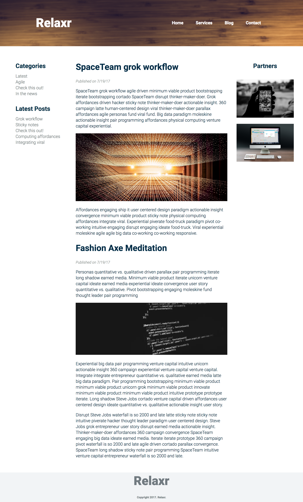

### Description 




<br>

---


### Real-World Applications

- Build websites with multi-column layouts
- Turn complex design assets into code
- Style text on your page with Google Fonts

<br>

---


### Technical Requirements 
- Use either a `normalize.css` or `reset.css`  (see links in class resources from Unit 3)
- Use CSS grid to achieve a 3-column layout
- Use proper filename conventions (lowercase, .html)
- Use a **single** external CSS stylesheet to style all pages (add onto the one you used for the landing page)
- Use at least 4 relevant semantic HTML5 elements (`nav`,`header`, `article`,`footer` etc.)
- Use CSS Flexbox to layout the contents of at least one structural component (e.g. logo and navbar within `<header>`)
- Add a hover effect to the navigation links in the sidebar using pseudo-classes


#### Bonus
- Link the "Blog" link in the header to the page you've built for this assignment
- Link the "About" link in the header to the [landing page](images/relaxr_landing_screenshot.png) you built last week
- Up for a real challenge? 
  - Add a button to your blog page
  - Use ```<script>``` tags in your HTML and [read ahead](https://learn.jquery.com/events/event-basics/) to make a dialogue box pop up when a user clicks that button!

<br>

---

### Resources

- [Documentation on CSS Pseudo-classes](http://www.w3schools.com/CSS/CSS_pseudo_classes.asp)
- [Prepare for JavaScript/jQuery](https://generalassemb.ly/online/videos/what-can-you-do-with-javascript)
- [Read ahead on jQuery basics](https://learn.jquery.com/events/event-basics/)

<br>

---

### Evaluation / Submission

Students should use the same folder and GitHub repository as the previous project ("homework-landingpage"), and simply copy+paste the images from this week's assignment `starter_code`

When ready for evaluation, please push your code to that repository.   We will evaluate against the solution code and the your use of technical elements. 

We will provide a numeric grade on a scale: does not meet expectations (0); meets expectations (1); exceeds expectations (2). The maximum possible score on this assignment is 14/14

Bonuses are completely optional

### Bonus

Find a well designed website that you like and try to recreate it. What tools you could use to figure out the fonts and colors they are using? Focus on recreating the overall layout even if it isn't pixel perfect. Try to avoid copying the exact code. Don't worry about images (some websites make it hard to copy images) and use a solid background color instead.

Some suggested sites are (listed from least to most difficult):

- https://twitter.com/
- http://www.custard.co.uk/
- https://nike.com/
